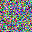

# Diffusion-from-Scratch

## Overview

This repository contains a PyTorch implementation of diffusion models, developed from first principles by two contributors. Key features include a cosine noise schedule, class-guided diffusion (without an external classifier), and training examples on CIFAR-10 and MNIST.

## Features

- **Diffusion Model:** Implemented from scratch in PyTorch.
- **Cosine Schedule:** Noise schedule following a cosine pattern for improved image quality.
- **Class-Guided Diffusion:** Directly conditioned on class labels, without requiring an external classifier.
- **Training Datasets:** Trained on CIFAR-10 and MNIST.

A sample GIF demonstrating the model generating a new image is provided below.

